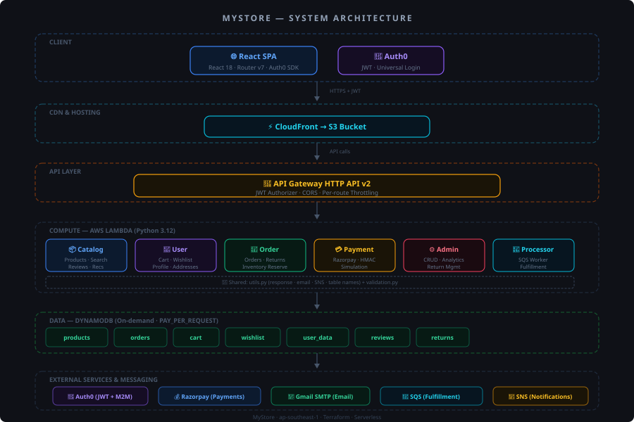

# MyStore E-commerce Platform

A full-stack serverless e-commerce platform built with React, AWS Lambda, DynamoDB, and Auth0. Features atomic inventory management, Razorpay payment integration with signature verification, per-function IAM isolation, structured observability, and a comprehensive test suite (200 backend + 28 UI tests).

**Live:** [https://d3hckftk4ilq7v.cloudfront.net](https://d3hckftk4ilq7v.cloudfront.net)

**Demo Admin Access:**
| Email | Password |
|-------|----------|
| `kguruprasadreddy2004@gmail.com` | `Guru@123` |

> Login and navigate to the "Profile -> Admin Panel" to explore dashboard analytics, product management, order management, and return workflows.

## 🚀 Features

- **Product Catalog** - Browse, search, and filter products with progressive loading and pagination
- **Product Variants** - Size, color, and capacity options for products
- **Shopping Cart** - Add/remove items with variant support, stock validation, and 7-day TTL auto-expiry
- **Wishlist** - Save favorite products for later (move-to-cart with stock guard)
- **User Authentication** - Secure Auth0 JWT-based authentication with custom claims
- **Order Management** - Atomic inventory reservation with rollback, idempotent creation, status history tracking
- **Payment Processing** - Razorpay integration with HMAC-SHA256 verification and simulation fallback
- **Product Reviews** - Rate and review products (verified purchase only, one per user per product)
- **Return Management** - Request, approve, reject, and refund returns with email notifications at each step
- **Admin Panel** - Manage products, orders, returns, and inventory with cached analytics dashboard
- **Email Notifications** - Transactional emails via Gmail SMTP with retry and exponential backoff (verified users only)
- **Order History Filters** - Filter orders by status, date range, and sort order
- **Email Verification Reminders** - Banner and checkout warning for unverified users
- **Recommendations Engine** - Category-aware product recommendations using DynamoDB GSI queries
- **Error Resilience** - React error boundaries, graceful degradation, dead-letter queue for failed messages

## 🏗️ Architecture



**Key flows:**
- **Browse** → CloudFront → API Gateway → Catalog Lambda → DynamoDB
- **Order** → API Gateway (JWT) → Order Lambda → reserve inventory (atomic) → save → SNS + Gmail
- **Payment** → API Gateway (JWT) → Payment Lambda → Razorpay verify (HMAC) → SQS → Processor → shipped
- **Admin** → API Gateway (JWT + role claim) → Admin Lambda → DynamoDB

**Architecture characteristics:**
- 6 independent Lambda microservices, each with its own least-privilege IAM role
- DynamoDB on-demand billing with GSIs for efficient query patterns
- Asynchronous order fulfillment via SQS with dead-letter queue (5 retries)
- Per-route API throttling (payment: 5 req/s, orders: 10 req/s, catalog: 100 req/s)
- CORS restricted to production CloudFront domain + localhost
- Structured JSON logging across all services for CloudWatch Insights

---

## 🛠️ Tech Stack

### Frontend
- **React 18** - UI framework with hooks-based architecture
- **React Router v7** - Client-side routing
- **Auth0 React SDK** - Authentication with token caching
- **CSS3** - Component-scoped styling (no framework dependencies)
- **Error Boundaries** - Graceful error handling for component failures

### Backend
- **AWS Lambda** - Serverless compute (Python 3.12, zero external dependencies)
- **API Gateway HTTP API** - RESTful API with JWT authorizer and per-route throttling
- **DynamoDB** - NoSQL database with GSIs, TTL, and point-in-time recovery
- **SQS** - Asynchronous order processing with dead-letter queue
- **SNS** - Admin notifications via email subscription

### Infrastructure
- **Terraform** - Infrastructure as Code (13 files, fully reproducible)
- **CloudFront** - CDN for frontend distribution (global edge locations)
- **S3** - Static website hosting with OAI access control
- **IAM** - Per-function least-privilege roles (6 separate roles, no `FullAccess` policies)

### Observability
- **Structured Logging** - JSON log lines from all services (queryable via CloudWatch Insights)
- **API Access Logs** - Per-request logging: IP, method, path, status, latency, user ID
- **CloudWatch Metrics** - Lambda invocations/duration/errors, API Gateway 4xx/5xx, DynamoDB capacity

### Third-Party Services
- **Auth0** - User authentication and authorization (OAuth 2.0 / OIDC)
- **Razorpay** - Payment gateway with HMAC signature verification (Indian market)
- **Gmail SMTP** - Transactional email delivery (App Password, retry with exponential backoff)

### Testing
- **pytest + moto** - 200 backend unit tests with mocked DynamoDB
- **Playwright + POM** - 28 UI automation tests (Page Object Model pattern)
- **GitHub Actions** - CI pipeline: test → build → package on every push

##  Project Structure

```
.
├── frontend/                 # React frontend application
│   ├── src/
│   │   ├── components/      # React components (with component-scoped CSS + ErrorBoundary)
│   │   ├── hooks/           # Custom React hooks (useProducts, useCart, useOrders, etc.)
│   │   └── services/        # API service layer (apiFetch, getHeaders, idempotency)
│   └── public/              # Static assets
├── services/                # Lambda function handlers (Python 3.12, zero external deps)
│   ├── catalog_service.py   # Product catalog, search, reviews & recommendations (GSI-based)
│   ├── order_service.py     # Order management, returns, idempotency, atomic inventory
│   ├── payment_service.py   # Payment processing (Razorpay HMAC + simulation)
│   ├── user_service.py      # User profile, cart (TTL), wishlist & addresses
│   ├── admin_service.py     # Admin operations, analytics (cached 60s)
│   ├── order_processor.py   # SQS async fulfillment (paid → shipped)
│   ├── utils.py             # Structured logger, response helper, email (retry), SNS, DynamoDB
│   └── validation.py        # Schema-based input validation (no external dependencies)
├── infrastructure/          # Terraform IaC (13 files)
│   ├── main.tf             # Provider configuration
│   ├── lambda.tf           # Lambda functions (per-function IAM role assignment)
│   ├── api.tf              # API Gateway: routes, JWT auth, CORS, per-route throttling
│   ├── api_versioning.tf   # Versioned API routes (v1)
│   ├── dynamodb.tf         # 7 database tables with GSIs, TTL, PITR
│   ├── messaging.tf        # SQS (+ DLQ) & SNS
│   ├── frontend.tf         # S3 & CloudFront (OAI, SPA fallback)
│   ├── iam.tf              # 6 per-function least-privilege IAM roles
│   └── observability.tf    # CloudWatch log groups for API access logs
├── tests/                  # 200 pytest tests (moto for DynamoDB mocking)
├── scripts/                # Deployment & utility scripts
│   ├── build_lambdas.ps1   # Package Lambda functions (service + utils + validation)
│   ├── deploy_frontend.ps1 # Deploy frontend to S3
│   └── seed_products.py    # Seed initial product data (50 products, 5 categories)
├── docs/                   # 12 documentation files + architecture SVG
└── .github/workflows/      # CI pipeline (test → build → package)
```

## 🔑 Key Endpoints

### Public Endpoints (No Auth Required)
- `GET /products` - List products with pagination and filters (category, price, sort)
- `GET /products/{id}` - Get product details
- `GET /products/{id}/variants` - Get product variants (size, color, capacity)
- `GET /products/{id}/reviews` - Get product reviews (paginated, newest first)
- `GET /search` - Search products with filters (brand, rating, stock, price)
- `GET /recommendations` - Category-aware product recommendations
- `GET /health` - Service health check

### Protected Endpoints (Auth Required)
- `GET /cart` - Get cart contents
- `POST /cart/add` - Add item to cart (with variant support + stock validation)
- `DELETE /cart/remove/{id}` - Remove/decrement item from cart
- `POST /order` - Create order (idempotent with `idempotency_key`)
- `GET /order` - Get order history (user's orders only)
- `PUT /order/{id}` - Update order status (valid transitions only, owner only)
- `DELETE /order/{id}` - Cancel order (restores inventory atomically)
- `POST /payment/create-order` - Create Razorpay order (or simulation mode)
- `POST /payment` - Verify payment + trigger async fulfillment
- `GET /wishlist` - Get wishlist
- `POST /wishlist/add` - Add to wishlist
- `POST /products/{id}/reviews` - Submit product review (verified purchase only)
- `POST /return` - Create return request (delivered orders only)
- `GET /return/{id}` - Get return request details (owner only)
- `GET/PUT /profile/me` - User profile management
- `GET/POST/PUT/DELETE /addresses/*` - Saved addresses

### Admin Endpoints (Admin Role Required)
- `GET /admin/dashboard` - Dashboard analytics with time-series data (cached 60s)
- `GET /admin/products` - List all products
- `POST /admin/products` - Add product
- `PUT /admin/products/{id}` - Update product
- `DELETE /admin/products/{id}` - Delete product
- `GET /admin/orders` - List all orders (filterable by status)
- `PUT /admin/orders/{id}` - Update order status
- `GET /admin/returns` - List all return requests (filterable)
- `PUT /admin/returns/{id}/approve` - Approve return request
- `PUT /admin/returns/{id}/reject` - Reject return request with reason
- `PUT /admin/returns/{id}/refund` - Process refund for approved return

See [API Documentation](docs/API.md) for complete API reference.

## 🧪 Testing

```bash
# Run all 200 backend tests
python -m pytest tests/ -v

# Run specific test file
python -m pytest tests/test_catalog_service.py -v

# Run by marker
python -m pytest -m smoke      # Quick validation
python -m pytest -m unit       # Fast, isolated tests
```

**Test coverage includes:** order creation with inventory reservation/rollback, payment decline rules, idempotency (duplicate detection), ownership checks (403 for unauthorized), status transition validation, pricing calculations, variant handling, input validation edge cases, email verification enforcement.

### UI Automation Tests

```bash
cd "MyStore - AT"
pip install -r requirements.txt
playwright install chromium
pytest                          # 28 tests (headed mode)
pytest --headless               # CI mode
pytest -m quickview             # Specific feature
```

### CI/CD Pipeline

GitHub Actions runs on every push/PR to `main`:
1. **Backend Tests** - Python 3.12 + pytest + moto (mocked DynamoDB)
2. **Frontend Build** - Node.js 18, verifies production build succeeds
3. **Lambda Packaging** - Verifies all 6 zips build correctly (service + utils + validation)

## 📊 Observability

- **Structured Logging** - All Lambda functions emit JSON log lines (`{"level": "ERROR", "action": "...", "order_id": "..."}`) queryable via CloudWatch Insights
- **API Access Logs** - Every request logged with IP, method, path, status, latency (ms), user ID
- **CloudWatch Metrics** - Lambda invocations/duration/errors, API Gateway request counts, DynamoDB capacity
- **DLQ Monitoring** - Dead-letter queue captures failed order processing messages (after 5 retries)

## 🔒 Security

- **JWT Authentication** - Auth0-issued tokens validated at API Gateway level (not in application code)
- **Role-Based Authorization** - Admin role via custom JWT claim (`https://mystore.com/roles`)
- **IAM Per-Function Isolation** - 6 separate least-privilege roles (catalog can't touch cart, payment can't read products)
- **CORS Lockdown** - Restricted to production CloudFront domain + localhost (not `*`)
- **HTTPS Only** - All API traffic encrypted via API Gateway
- **Payment Security** - HMAC-SHA256 signature verification for Razorpay callbacks, amount mismatch rejection
- **Idempotent Orders** - Duplicate requests return existing order (prevents double-charge)
- **Status Machine Enforcement** - Customer endpoint only allows valid state transitions
- **Ownership Checks** - Users can only view/cancel/return their own orders (403 for others)
- **Input Validation** - Schema-based validation (type, pattern, length, nested) on all user inputs
- **Rate Limiting** - Per-route throttling: payment 5 req/s, orders 10 req/s, catalog 100 req/s
- **Data Protection** - DynamoDB encryption at rest, point-in-time recovery (35 days)
- **Email Safety** - Transactional emails only sent to verified addresses
- **Secrets Isolation** - Razorpay keys only injected into payment Lambda, Auth0 M2M only into user Lambda

## 🚀 Deployment

### Production Deployment Checklist

- [x] Per-function IAM roles with least-privilege policies
- [x] CORS restricted to production domain
- [x] API Gateway per-route throttling configured
- [x] DynamoDB point-in-time recovery enabled
- [x] SQS dead-letter queue configured
- [x] Structured logging enabled across all services
- [x] API access logging enabled
- [x] Input validation on all user-facing endpoints
- [x] CI/CD pipeline running tests on every push
- [ ] Configure custom domain for API Gateway (optional)
- [ ] Enable CloudFront custom domain with SSL certificate (optional)
- [ ] Set up WAF rules for API protection (optional)
- [ ] Enable Lambda provisioned concurrency for catalog + payment (optional)

## 📋 Prerequisites

- **Node.js** 18+ and npm
- **Python** 3.12+
- **Terraform** 1.0+
- **AWS CLI** configured with appropriate credentials
- **Auth0 account** with API configured
- **Razorpay account** (optional, falls back to simulation)
- **Gmail account** with App Password (optional, for email notifications)

## ⚡ Quick Start

### 1. Clone the repository

```bash
git clone https://github.com/guruprasadreddyk/MyStore.git
cd MyStore
```

### 2. Configure environment variables

Create `infrastructure/terraform.tfvars`:

```hcl
aws_region              = "ap-southeast-1"
aws_profile             = "your-aws-profile"
notification_email      = "your-email@example.com"
auth0_domain            = "your-tenant.auth0.com"
auth0_audience          = "https://api.mystore.com"
auth0_m2m_client_id     = "your-m2m-client-id"
auth0_m2m_client_secret = "your-m2m-client-secret"
razorpay_key_id         = "your-razorpay-key-id"
razorpay_key_secret     = "your-razorpay-key-secret"
smtp_user               = "yourstore@gmail.com"          # optional
smtp_password           = "xxxx xxxx xxxx xxxx"          # Gmail App Password
smtp_from               = "MyStore <yourstore@gmail.com>"
frontend_domain         = ""                             # set after first deploy
```

### 3. Build Lambda packages

```powershell
.\scripts\build_lambdas.ps1
```

This packages each service with `utils.py` + `validation.py` into deployment zips.

### 4. Deploy infrastructure

```bash
cd infrastructure
terraform init
terraform plan
terraform apply
```

Note the outputs:
- `api_url` - Your API Gateway endpoint
- `cloudfront_url` - Your frontend CDN URL
- `s3_bucket_name` - Frontend hosting bucket

### 5. Set CORS domain

After first deploy, add your CloudFront domain to `terraform.tfvars`:

```hcl
frontend_domain = "d1234abcd.cloudfront.net"
```

Then run `terraform apply` again to lock down CORS.

### 6. Seed products

```bash
python scripts/seed_products.py
```

### 7. Build and deploy frontend

```bash
cd frontend
npm install
npm run build

# Deploy to S3 (PowerShell)
cd ../scripts
./deploy_frontend.ps1
```

### 8. Configure Auth0

1. Create an Auth0 Application (Single Page Application)
2. Set **Allowed Callback URLs**: `http://localhost:3000, https://your-cloudfront-url`
3. Set **Allowed Logout URLs**: `http://localhost:3000, https://your-cloudfront-url`
4. Set **Allowed Web Origins**: `http://localhost:3000, https://your-cloudfront-url`
5. Create an API with identifier: `https://api.mystore.com`
6. Create a **Post-Login Action** with the following code and add it to the Login flow:
   ```javascript
   exports.onExecutePostLogin = async (event, api) => {
     const ns = 'https://mystore.com/';
     api.accessToken.setCustomClaim(ns + 'email', event.user.email);
     api.accessToken.setCustomClaim(ns + 'email_verified', event.user.email_verified);
     api.accessToken.setCustomClaim(ns + 'roles', event.authorization?.roles || []);
   };
   ```
7. Update `frontend/src/index.js` with your Auth0 domain and client ID

### 9. Access the application

- **Production**: `https://your-cloudfront-url`
- **Local Development**: `npm start` (from frontend directory)

## 📖 Documentation

Detailed documentation is available locally in the `docs/` directory:

- **API.md** - Complete API documentation with examples
- **ARCHITECTURE.md** - System design, component details, and data flow
- **DATABASE.md** - DynamoDB table structures and GSIs
- **FEATURES.md** - Detailed feature documentation with business logic
- **SETUP.md** - Detailed setup instructions
- **DEPLOYMENT.md** - Production deployment
- **SECURITY.md** - Security practices and threat model
- **MONITORING.md** - Observability and debugging
- **PERFORMANCE.md** - Performance considerations
- **INTEGRATIONS.md** - Third-party service details
- **TESTING.md** - Test strategy and coverage
- **TROUBLESHOOTING.md** - Common issues and fixes

## 🔮 Future Work

### Observability
- **X-Ray tracing** — Distributed tracing across Lambda functions to identify latency bottlenecks
- **CloudWatch Alarms** — Automated alerts for 5xx error rates, DLQ depth, and payment latency
- **Custom metrics dashboard** — CloudWatch dashboard for order volume, payment success rate, and inventory alerts

### Security
- **AWS WAF** — Web Application Firewall for IP-based rate limiting, bot protection, and OWASP rule sets
- **DynamoDB-based rate limiting** — Per-user request counters for sensitive endpoints (`/payment`, `/order`)
- **Secrets Manager** — Move SMTP and Razorpay credentials to AWS Secrets Manager with runtime lookup

### Infrastructure
- **Lambda provisioned concurrency** — Eliminate cold starts on the catalog and payment services
- **Multi-region deployment** — DynamoDB Global Tables + multi-region Lambda for disaster recovery

### Features
- **Order tracking page** — Real-time shipment tracking with carrier integration
- **Discount codes and coupons** — Promo code validation at checkout
- **Inventory alerts** — Notify admin via SNS when stock drops below a configurable threshold
- **Review moderation** — Admin endpoint to flag or remove reviews

## 🤝 Contributing

1. Fork the repository
2. Create a feature branch (`git checkout -b feature/amazing-feature`)
3. Commit your changes (`git commit -m 'Add amazing feature'`)
4. Push to the branch (`git push origin feature/amazing-feature`)
5. Open a Pull Request

## 🙏 Acknowledgments

- Auth0 for authentication infrastructure
- AWS for serverless platform
- Razorpay for payment processing
- Gmail SMTP for email delivery
- Picsum Photos for placeholder images

---